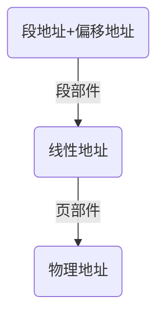

Intel32位处理器架构，简称IA-32（Intel Architect，32-bi时Intel32位处理器架构，简称IA-32（Intel Architect，32-bi）。

所谓处理器架构，或者处理器编程架构，是指一整套的硬件架构，以及与之相适应的工作状态。

其中的灵魂部分就是一种设计理念，决定了处理器的应用环境和工作模式，也决定了软件开发人员如何在这种模式下解决实际问题。

32位处理器除了扩展数据线和地址线，还增加了高速缓存，流水线，浮点数处理，多处理器（核）管理，多媒体扩展，乱序执行，分支预测，虚拟化，温度和电源管理等。

#### 10.1 IA-32架构的基本执行环境
##### 10.1.1 寄存器的扩展
* 原有的8个通用寄存器进行扩展（Extend）。
AX -> EAX

BX -> EBX

CX -> ECX

DX -> EDX

SI -> ESI

DI -> EDI

SP -> ESP

BP -> EBP

* 指令寄存器进行扩展
IP -> EIP
* 标志寄存器
FLAGS -> EFLAGS
* 段寄存器还是16位，但是保存的不再是段地址，而是段选择子
CS、SS、DS、ES、FS、GS

##### 10.1.2 基本工作模式
在刚加电时，80386，80286处理器都自动处于实模式下，此时它相当于一个非常快速的8086处理器。只有在进行一番设置之后，才能运行在保护模式下。
* 实模式
* 保护模式
* 虚拟8086模式（V86模式）

##### 10.1.3 线性地址
* 段地址和偏移地址称为逻辑地址，偏移地址叫做有效地址（Effective Address，EA）。
* 分页功能：将物理内存划分成逻辑上的页。页的大小是固定的，一般为4KB，通过使用页，可以简化内存管理。解决内存空间碎片化的问题。

#### 10.2 现代处理器的结构和特点
##### 10.2.1 流水线
为了提高处理器的执行效率和执行速率，可以把一条指令的执行过程分解成若干细小的步骤，并分配给相应的单元来完成。各个单元的执行是独立的，并行的。如此一来，各个步骤的执行在时间上就会重叠起来，这种执行指令的方法就是流水线（Pipr-Line）技术。
##### 10.2.2 高速缓存
影响处理器速度的另一个因素是存储器。从处理器内部向外看，它们分别是寄存器，内存和硬盘。
* 寄存器：SRAM，速度是纳秒（ns）级别。
* 内存：DRAM，速度是几十个纳秒（ns）级别。
* 硬盘：ROM，毫秒（ms）级别。
高速缓存是处理器与内存（DRAM）之间的一个静态缓存存储器，容量较小，但速度可以与处理器匹配。

#### 10.3 32位模式的指令系统
##### 10.3.1 32位处理器的寻址方式


##### 10.3.2 IA-32指令格式
* 前缀：前缀是可选的，每个前缀的长度是1字节，每条指令可以有1~4个前缀，或者不适用前缀。
* 操作码：操作码的长度是1~3字节。同时操作码还可以用来指示操作的字长，即数据宽度为字节还是字。
* 寻址方式和操作数类型：这部分是可选的，简单的指令不包含这一部分。稍微复杂一点的指令，这一部分只有1字节。最复杂的指令，可能有2个字节。这部分给出了指令的寻址方式，以及寄存器的类型（用的是哪个寄存器）。
* 立即数和偏移量：如果指令中使用了立即数和偏移量，那么立即数和偏移量就在这一部分给出。
```
mov cx, [0x2000]
mov ecx, [eax + ebx * 8 + 0x02]
;偏移量0x2000和0x02在这一部分出现
```


##### 10.3.3 一般指令的扩展
讲了各个指令在IA-32中的扩展，即我们之前的指令只能实现16位的操作，但是在IA-32的架构下，指令扩展为可以支持32位的操作。由于32位的处理器都拥有32位的寄存器和算术逻辑部件，而且同内存芯片之间的数据通路至少是32位的，因此所有以寄存器或者内存单元为操作数的指令都被扩充，以适应32位的逻辑运算操作。


例如在16位的处理器上，无符号乘法指令`mul`的格式为
```
mul r/m8 ; AX <- AL x r/m8
mul r/m16 ; DX:AX <- AX x r/m16
```
在32位处理器上，除了依然支持上述的操作外，还支持以下的扩展格式
```
mul r/m32 ; EDX:EAX <- EAX x r/m32 
```


